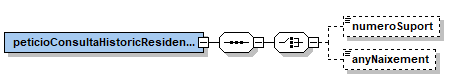
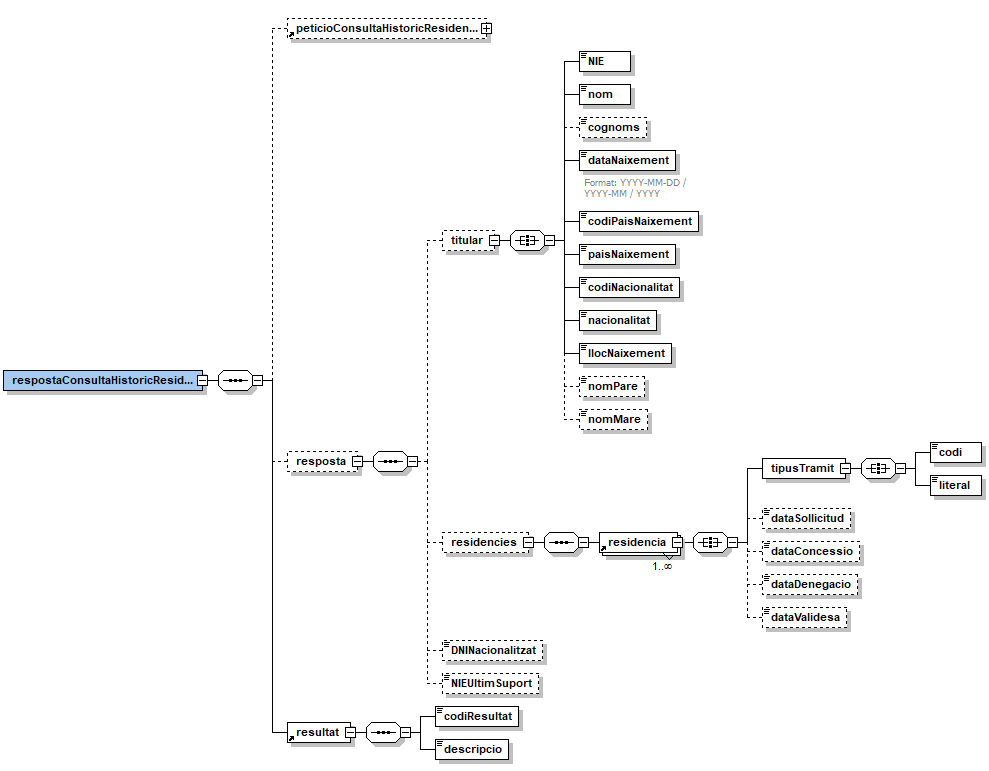

# VO_DGP_RESIDENCIA

# **Via Oberta – DGP (Tràmits de residència)**

# **Document d'integració del servei**

**Control del document**

**Informació general**

| **Títol:** | Via Oberta – DGP (Residència) |
| --- | --- |
| **Creat per:** | Àrea de Tecnologia – Projectes |
| **A revisar per:** | Àrea de Tecnologia – Suport Tècnic |
| **A aprovar per:** | Àrea de Tecnologia – Suport Tècnic |
| **Llista de distribució:** |
 

**Històric de revisions**

| **Versió** | **Data** | **Autor** | **Comentaris** |
| --- | --- | --- | --- |
| V1.0 | 18/05/2022 | Roger Noguera i Arnau | Creació del document. |

**Índex**

- [1. Introducció](#1)
- [2. Transmissions de dades disponibles](#2)
- [3. Missatgeria dels serveis](#3)
    * [3.1 Consulta de l'històric de tràmits de residència legal (TRAMITS\_RESIDENCIA)](#3.1)
    * [3.1.1 Petició – dades genèriques](#3.1.1)
    * [3.1.2 Petició – dades específiques](#3.1.2)
    * [3.1.3 Resposta – dades específiques](#3.1.3)
- [4. Joc de proves](#4)

# 1 Introducció 

Aquest document detalla la missatgeria associada al servei de consulta de dades de Tràmits de residència de la Dirección General de la Policía (en endavant DGP).

Per a poder realitzar la integració cal conèixer prèviament la següent documentació:

- [Document de Missatgeria Genèrica de la PCI del Consorci AOC.][PCI]
 
[PCI]:https://github.com/ConsorciAOC/PCI

# 2 Transmissions de dades disponibles 

Les dades disponibles a través del servei són les que es presenten a continuació:

| **EMISSOR** |
| --- |
| DGP – Dirección Gral. de la Policía |

| **PRODUCTE** | **MODALITAT** | **DESCRIPCIÓ** |
| --- | --- | --- |
| **DGP\_RESIDENCIA** | TRAMITS\_RESIDENCIA | Consulta de l'històric de tràmits de residència legal. |

Les modalitats tenen disponible la versió imprimible del resultat de la consulta en format PDF. Per més detalls adreceu-vos a l'apartat _Extensions de missatgeria_ del document de missatgeria genèrica.

# 3 Missatgeria dels serveis 

A continuació es detalla la missatgeria corresponent al bloc de dades específiques de les modalitats de consum del producte.

 
> L'emissor de les dades requereix que s'informin les dades del funcionari que realitza la consulta. Així, cal informar els següents camps de l'element Funcionario del bloc de dades genèriques:
/Peticion/Funcionario/NombreCompletoFuncionario, /Peticion/Funcionario/NifFuncionario,//SolicitudTransmision/DatosGenericos/Solicitante/Funcionario/NombreCompletoFuncionario i//SolicitudTransmision/DatosGenericos/Solicitante/Funcionario/NifFuncionario    

                       

## 3.1 Consulta de l'històric de tràmits de residència legal (TRAMITS\_RESIDENCIA) 

### 3.1.1 Petició – dades genèriques 

| _Element_ | _Descripció_ |
| --- | --- |
| //DatosGenericos/Titular/TipoDocumentacion | Tipus de documentació (NIE). |
| //DatosGenericos/Titular/Documentacion | Documentació. <li> NIE ([X,Y,Z] + 7 dígits + caràcter de control). |
| //DatosGenericos/Titular/Apellido1 | Primer cognom del titular. Opcional, si no s'informa cal informar el número de suport o l'any de naixement de les dades especifiques. Cal informar-lo en majúscules i tal i com apareix a la filiació. |
| //DatosGenericos/Titular/Apellido2 | Segon cognom del titular (si existeix). Opcional, si no s'informa cal informar el número de suport o l'any de naixement de les dades especifiques. Cal informar-lo en majúscules i tal i com apareix a la filiació. |

### 3.1.2 Petició – dades específiques 

| _Element_ | _Descripció_ |
| --- | --- |
| /peticioConsultaHistoricResidencia/numeroSuport | Número de suport del titular consultat i associat al NIE:<li> Ciutadà estranger comunitari: C + 8 dígits (on els dígits es corresponen al número de certificat comunitari).<li> Ciutadà estranger: E + 8 dígits (on els dígits coincideixen al número de targeta d'identificació estrangera).|
| /peticioConsultaHistoricResidencia/anyNaixement | Any de naixement del titular consultat (format AAAA).|

 Es recomana fer les consultes per any de naixement abans que fer-ho per cognoms o número de suport. 

### 3.1.3 Resposta – dades específiques 

| _Element_ | _Descripció_ |
| --- | --- |
| /respostaConsultaHistoricResidencia/peticioConsultaHistoricResidencia | Bloc de dades corresponent a la petició que origina la resposta. |
| /respostaConsultaHistoricResidencia/resposta/titular | Bloc que conté les dades d'una resposta amb dades del titular. |
| //titular/NIE | NIE del titular. |
| //titular/nom | Nom del titular. |
| //titular/cognoms | Cognoms del titular. |
| //titular/dataNaixement | Data de naixement del titular (pot presentar diversos formats: AAAA-MM-DD / AAAA-MM / AAAA). |
| //titular/codiPaisNaixement | Codi de país de naixement del titular. |
| //titular/paisNaixement | País de naixement. |
| //titular/codiNacionalitat | Codi de nacionalitat del titular. |
| //titular/nacionalitat | Nacionalitat del titular. |
| //titular/llocNaixement | Lloc de naixement del titular. |
| //titular/nomPare | Nom del pare del titular. |
| //titular/nomMare | Nom de la mare del titular. |
| /respostaConsultaHistoricResidencia/resposta/residencies/residencia | Bloc de dades corresponent a un tràmit de residència. |
| //residencia/tipusTramit/codi | Codi de tràmit. |
| //residencia/tipusTramit/literal | Nom del tràmit. |
| //residencia/dataSolicitud | Data de sol·licitud del tràmit (AAAA-MM-DD). Si no es retorna, indicarà que és indefinida. |
| //residencia/dataConcessio | Data de concessió del tràmit (AAAA-MM-DD). Si no es retorna, indicarà que és indefinida. |
| //residencia/dataDenegacio | Data de denegació del tràmit (AAAA-MM-DD). Si no es retorna, indicarà que és indefinida. |
| //residencia/dataValidesa | Data de validesa del tràmit (AAAA-MM-DD). Si no es retorna, indicarà que és indefinida. |
| //DNINacionalitzat | DNI del titular en cas d'estar nacionalitzat. |
| //NIEUltimSuport | NIE del titular en cas de tenir un altre NIE assignat al darrer número de suport coincident. Cal realitzar una nova consulta amb aquesta dada. |
| /respostaConsultaHistoricResidencia/resultat/codiResultat | Codi de resultat de l'operació:<li> 00: operació realitzada correctament.<li> altrament: error realitzant l'operació. Vegeu apartat d'aquest document. |
| /respostaConsultaHistoricResidencia/resultat/descripcio | Descripció del resultat. |

#### 3.1.3.1Codis d'error 

A continuació s'especifica la correspondència entre els codi d'error i la descripció associada al mateix per a la operació de verificació d'identitat:

| _Codi_ | _Descripció_ |
| --- | --- |
| 70 | NIE no existeix.. |
| 70 | NIE no existeix. |
| 71 | NIE nacionalitzat. |
| 72 | Existeixen diferents filiacions. |
| 73 | NIE no correspon amb el NIE associat al darrer suport. Es retorna el NIE pel qual cal realitzar la consulta. |
| 74 | Número de suport erroni. |
| 75 | NIE anul·lat, retingut o retornat social / voluntari. |
| 76 | NIE sense suport vàlid. |
| 77 | NIE no correspon amb targeta / certificat. |
| 78 | Número de targeta / certificat no existeix. |
| 79 | Certificat repetit. |
| 80 | NIE nacionalitzat sense DNI. |
| 83 | Existeixen diverses filiacions pel document. |
| 84 | Filiació no existeix. |
| 86 | Dades no disponibles. MENA actiu. |
| 0502 | Error realitzant l'operació. El detall de l'error apareix a la descripció. |

# 4 Joc de proves 

L'emissor final publica els següent [joc de proves a l'entorn de pre-producció][proves]
 
[proves]: https://administracionelectronica.gob.es/ctt/svd/descargas#.YvOZNXbP2Ul
 
 En cas de tindre problemes per accedir als jocs de proves, si us plau, obre un tiquet a través del [formulari][form]
 
[form]:https://suport.aoc.cat/hc/ca/requests/new
